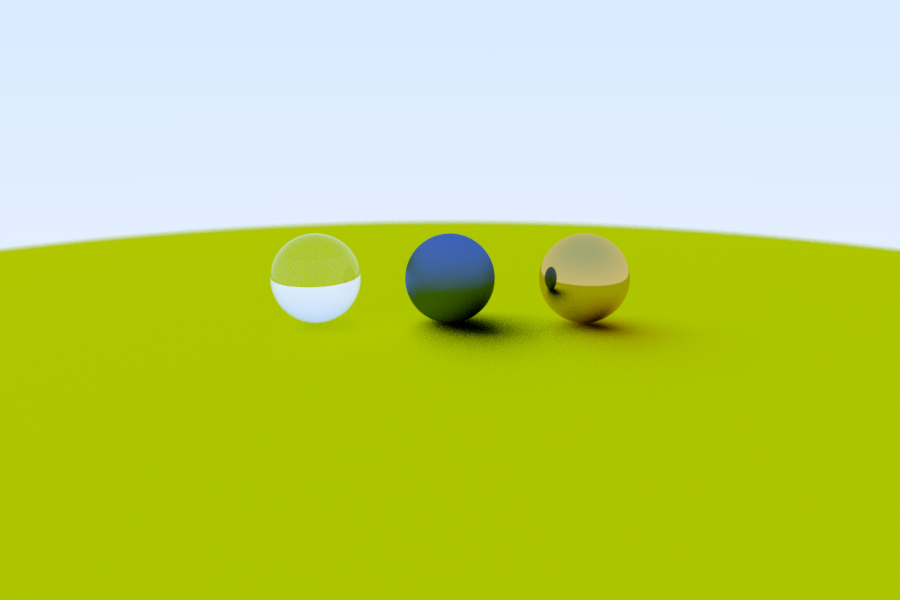

# Ray Tracer

A simple path tracer I wrote for a couple of days. I was mainly following the book "Ray Tracing in One Weekend" by Mr. Peter Shirley. The book uses C++ so I decided to write it in C, just so I can learn a bit more. 

